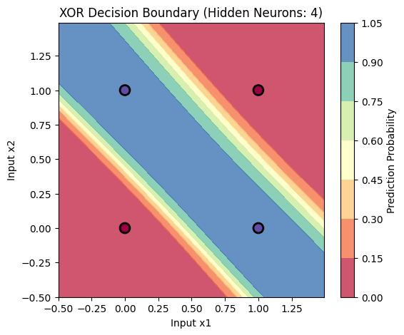

# ⚙️ Forward-Mode Auto-Differentiation Neural Network

This repository provides a lightweight neural network training framework based on **Forward-mode Auto-Differentiation** using **Dual Numbers**.

Built entirely from scratch without relying on mainstream deep learning libraries like PyTorch or TensorFlow, this project implements mathematical operations and gradient tracking to solve basic machine learning classification tasks and non-linear problems.

---

## 📂 Project Structure

The project features a modular design that separates the core differentiation engine from specific application scenarios:

### 🔹 `core.py`

Core computation module containing:

- `Dual` class → Implements dual number arithmetic and the chain rule
- `AutoDiffEngine` → Handles gradient computation via forward propagation
- `NNOps` → Provides neural network operations (e.g., Sigmoid, dot product)

---

### 🔹 `image_recognition.py`

- Implements a **single-layer Logistic Regression model**
- Performs binary classification on the **Scikit-learn Digits dataset**

---

### 🔹 `xor.py`

- Builds a **Multi-Layer Perceptron (MLP)**:
  - Input layer: 2 nodes
  - Hidden layer: 2 nodes
  - Output layer: 1 node
- Solves the classic **non-linear XOR problem**

---

### ▶️ Run Image Recognition Training

```bash
uv run image_recognition.py
```

### ▶️ Run XOR Neural Network Training

```bash
uv run xor.py
```

---

## 📊 Experimental Results

We evaluated the core differentiation engine (`core.py`) on two tasks of varying complexity.

---

### 🧠 1. Image Recognition (Digits Dataset)

- Model: Logistic Regression
- Parameters: 64 weights + 1 bias
- Learning rate: `0.5`

The loss rapidly converges within the first 10 steps:

```plaintext
Step  1 | Label: 1 | Pred: 0.8335 | Loss: 0.0277
Step  2 | Label: 0 | Pred: 0.3365 | Loss: 0.1133
Step  3 | Label: 0 | Pred: 0.0976 | Loss: 0.0095
Step  4 | Label: 0 | Pred: 0.1555 | Loss: 0.0242
Step  5 | Label: 0 | Pred: 0.1479 | Loss: 0.0219
Step  6 | Label: 0 | Pred: 0.0851 | Loss: 0.0072
Step  7 | Label: 0 | Pred: 0.0636 | Loss: 0.0040
Step  8 | Label: 0 | Pred: 0.0947 | Loss: 0.0090
Step  9 | Label: 0 | Pred: 0.0547 | Loss: 0.0030
Step 10 | Label: 0 | Pred: 0.0834 | Loss: 0.0070
```

---

### 🔀 2. XOR Computation

- Model: 2-layer MLP
- Learning rate: `1.0`

#### 📉 Early Training (Epoch 100)

```plaintext
--- Epoch 100 ---
Input: [0, 0] | True: 0 | Pred: 0.4814
Input: [0, 1] | True: 1 | Pred: 0.5188
Input: [1, 0] | True: 1 | Pred: 0.4756
Input: [1, 1] | True: 0 | Pred: 0.5137
```

#### 📈 After Convergence (Epoch 5000)

```plaintext
--- Epoch 5000 ---
Input: [0, 0] | True: 0 | Pred: 0.0264
Input: [0, 1] | True: 1 | Pred: 0.4987
Input: [1, 0] | True: 1 | Pred: 0.9749
Input: [1, 1] | True: 0 | Pred: 0.5011
```

> ✅ By Epoch 5000, the model successfully approximates the XOR truth table and learns the non-linear decision boundary.

---

## 🖼️ XOR Decision Boundary

The XOR problem is a classic **non-linear classification problem** that cannot be solved using a single-layer linear model.

With the addition of a hidden layer and the forward-mode autodiff engine, the model learns to **warp the feature space**, enabling correct classification.

- Colored points → XOR labels
- Background contour → Prediction probability distribution



---

## 🛠️ Technical Highlights

### 🧮 Dual Numbers

Uses the form:

```
a + bε   (where ε² = 0)
```

- Enables simultaneous computation of values and derivatives
- Eliminates the need for backward propagation

---

### ⚡ Graph-less Execution

- No computational graph construction required
- Gradients are computed **on-the-fly during forward pass**
- Achieved by wrapping inputs as `Dual` objects

---

### 🔗 Dynamic Lambda Binding

- Uses Python closures to bind training data dynamically
- Keeps architecture clean
- Avoids global variable pollution

---

## 📌 Summary

This project demonstrates that:

- Forward-mode autodiff is sufficient for small-scale neural networks
- Clean mathematical abstractions can replace heavy frameworks
- Neural networks can be implemented from scratch with minimal dependencies
