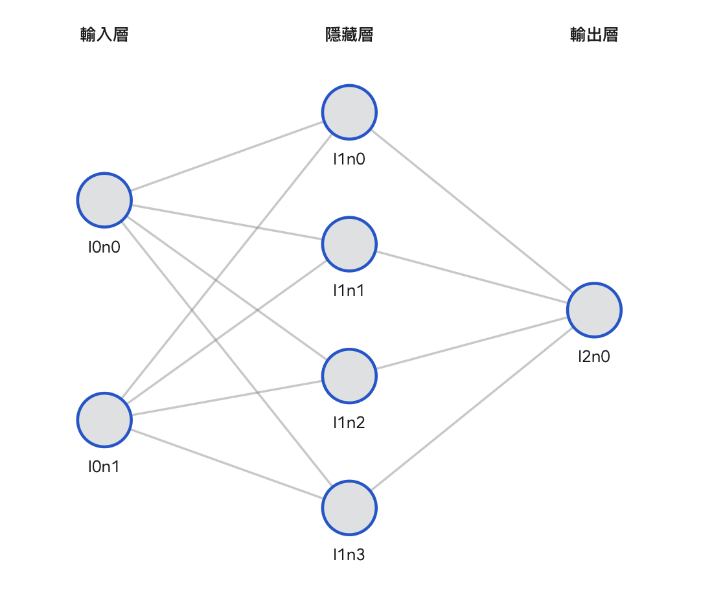

# Micrograd Implementation

A tiny Autograd engine and a neural network library on top of it, implemented entirely from scratch in Python.

**Acknowledgment & Citation:** This project is fundamentally based on and heavily inspired by [Andrej Karpathy's micrograd](https://github.com/karpathy/micrograd). This repository serves as an educational implementation to deeply understand the mechanics of automatic differentiation (backpropagation) and the foundational building blocks of neural networks.

---

## Overview

This project breaks down the "magic" of PyTorch's `nn.Module` and Autograd into bare-bones Python. It consists of three main components:

- **`core.py`**: The core Autograd engine. It implements a `Value` scalar object that tracks its computation history (a Directed Acyclic Graph) and overloads standard Python math operations (`+`, `-`, `*`, `**`, etc.) to automatically compute gradients via the chain rule during the `backward()` pass.
- **`engine.py`**: A minimal neural network library built on top of `Value`. It provides `Neuron`, `Layer`, and `MLP` (Multi-Layer Perceptron) classes, mirroring the API of modern deep learning frameworks.
- **`xor.py`**: A training script demonstrating the engine's capability to solve the classic non-linear XOR problem using a 2-layer MLP.

## Architecture: 2x4x1 MLP

To solve the XOR problem, this project utilizes a Multi-Layer Perceptron with the following architecture:

- **Input Layer**: 2 neurons (for the 2-dimensional XOR input features).
- **Hidden Layer**: 4 neurons with `tanh` non-linearity.
- **Output Layer**: 1 neuron (predicting the binary output).



## Example Training Run (XOR Problem)

The XOR problem is a classic example of a dataset that is not linearly separable, meaning a simple linear model cannot solve it. Our $2 \times 4 \times 1$ MLP uses the `tanh` activation function to warp the feature space and find the correct decision boundary.

### Target Data

```python
XOR_X = [[1, 1], [1, 0], [0, 1], [0, 0]]
XOR_Y = [ 1,     -1,     -1,      1   ]
```

### Training Logs (1000 Epochs)

```text
Epoch : 0, Loss: Value(data=6.587386741683309)
Epoch : 1, Loss: Value(data=6.391582348459031)
Epoch : 2, Loss: Value(data=6.165468059951921)
Epoch : 3, Loss: Value(data=5.915621464082659)
Epoch : 4, Loss: Value(data=5.656799570748539)
...
...
Epoch : 995, Loss: Value(data=0.035114334466083086)
Epoch : 996, Loss: Value(data=0.03506380491566904)
Epoch : 997, Loss: Value(data=0.03501341065897274)
Epoch : 998, Loss: Value(data=0.03496315117207746)
Epoch : 999, Loss: Value(data=0.03491302593370699)
```

## Final Predictions

After 1000 epochs with a learning rate of 0.01 and basic SGD, the model successfully outputs values extremely close to the targets `[1, -1, -1, 1]`:

```python
[
    Value(data=0.926810944032107),     # Target:  1
    Value(data=-0.9011636963728917),   # Target: -1
    Value(data=-0.8989281391106385),   # Target: -1
    Value(data=0.9021621134635093)     # Target:  1
]
```

## How to Run

Ensure you have Python installed (no external dependencies like PyTorch or NumPy are required for the core engine).

Run the XOR training script:

```bash
uv python xor.py
```
