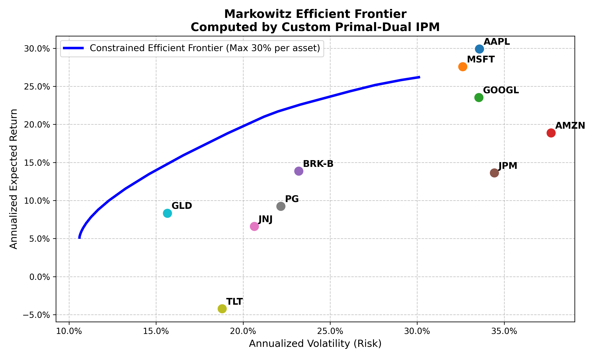
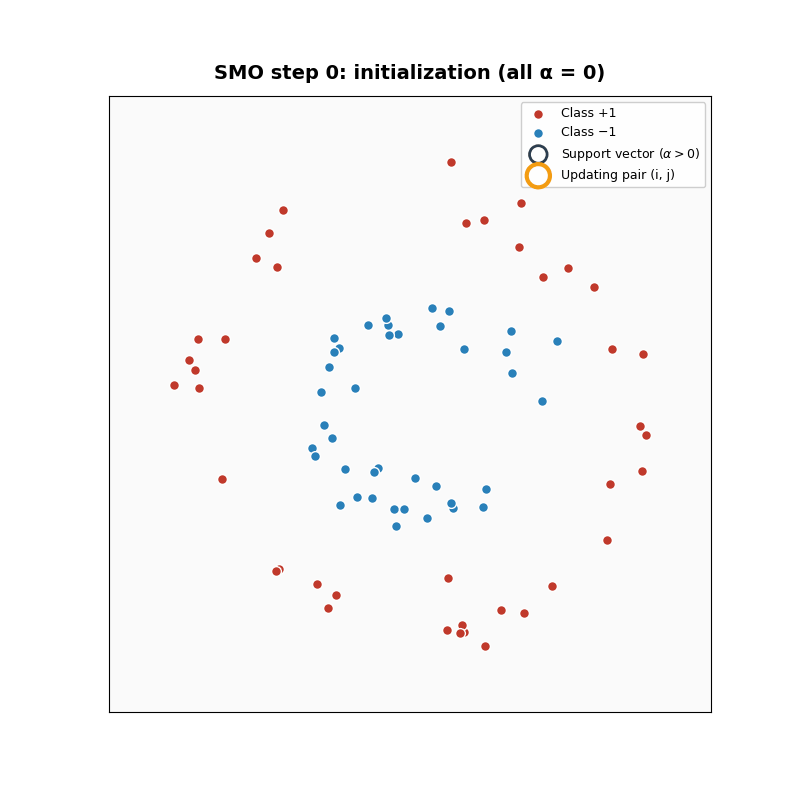

# Numerical Optimization Solvers & Applications

This project focuses on building numerical optimization algorithms entirely from scratch. We implemented core Interior Point Method (IPM) solvers and applied them to practical Quadratic Programming (QP) problems, specifically Portfolio Optimization in finance and Support Vector Machines (SVM) in machine learning.

## Project Structure

This project uses `uv` for dependency management. The main codebase is structured as follows:

```text
.
├── IPM/
│   ├── core/       # Core IPM algorithm implementations
│   ├── svm/        # SVM algorithms and QP formulations
│   ├── utils/      # Helper functions and visualization tools
│   ├── __init__.py
│   └── solver.py   # Main solver API interface
├── efficiency_frontier.py # Computes the portfolio efficient frontier
├── portfolio_demo.py      # Portfolio optimization demo script
├── pyproject.toml         # Project configuration file
└── uv.lock                # Lockfile for dependencies
```

## Core Algorithms: Interior Point Method

In `IPM/core`, we implemented two versions of the Interior Point Method for solving convex optimization problems with inequality constraints:

1. **Barrier Method (Basic Scaling Approach)**:
   The most intuitive implementation. This method adds a logarithmic barrier to the objective function. By monotonically increasing a penalty parameter $t$ (or $n$), it iteratively forces the solution to approach the optimum while strictly staying within the feasible region.
2. **Primal-Dual Interior Point Method**:
   A more advanced and numerically stable version. Instead of naively scaling an external parameter, this method applies Newton's method directly to the Karush-Kuhn-Tucker (KKT) conditions. By introducing a primal-dual system, the algorithm dynamically controls the duality gap, leading to significantly faster convergence.

## Quadratic Programming (QP) Applications

We applied our custom IPM solvers to two classic domains:

### 1. Portfolio Optimization
We formulated the Markowitz Mean-Variance Optimization model as a QP problem. The algorithm identifies the optimal asset allocation weights that maximize expected return for a given level of risk, ultimately plotting the complete efficient frontier.


*(Image Placeholder: The efficient frontier and optimal asset allocation weights computed by our IPM solver)*

### 2. Support Vector Machine (SVM)
For SVM, we explored two different approaches to solving its dual problem:
* **SMO (Sequential Minimal Optimization) Algorithm**: A heuristic algorithm specifically designed for SVMs. It analytically updates two variables at a time, completely avoiding large-scale matrix operations.
* **IPM Solver**: Treats the SVM strictly as a standard QP problem. The objective function and constraints are fed directly into our custom Primal-Dual IPM solver to find the optimal hyperplane.

We also implemented the Kernel Trick to handle non-linearly separable data. 


*(Image Placeholder: Non-linear classification decision boundary on the Make Circles dataset using Kernel SVM)*

## Work in Progress

The project is continuously evolving. We are currently working on the following advanced features:

1. **SVM Multi-class**
   * Expanding the current binary classifier to handle multi-class classification tasks by implementing One-vs-Rest (OvR) and One-vs-One (OvO) strategies.
2. **AutoDiff (Forward and Backward)**
   * Building a lightweight Automatic Differentiation engine from scratch, inspired by JAX. This will support both forward and backward passes, paving the way for more complex, non-linear optimization objective functions without the need to manually derive gradients.
3. **Enigma Solver**
   * Integrating our optimization framework with historical cryptography. We are building a solver capable of simulating and cracking the rotor settings of a WWII Enigma machine.

## Installation & Usage

Make sure you have Python and `uv` installed on your system.

```bash
# Install dependencies
uv sync

# Run the Portfolio Optimization Demo
uv run python portfolio_demo.py
```

## Special Thanks & Credits

* **Andrej Karpathy**: For the inspiration and profound insights into understanding the backpropagation process from the ground up.
* **ritvikmath (YouTube)**: For the excellent walkthroughs of the nitty-gritty mathematics behind Support Vector Machines.
* **Karlsruhe Institute of Technology (KIT)**: Special thanks to my professor for the Optimization course during my exchange semester, which laid the solid theoretical foundation for this project.
* **Gemini Pro 3.0**: You're the real MVP. I couldn't have done this without your guidance.
